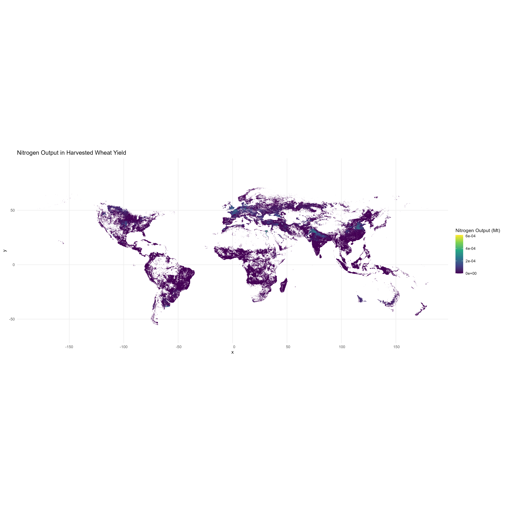
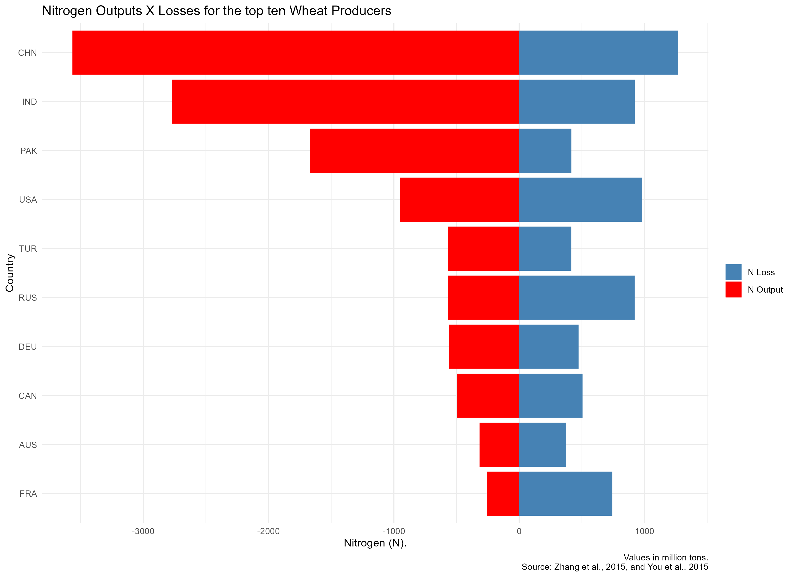

# Assignment

## Visualizations

### Global Production Volume

### Nitrogen Outputs X Losses for the Top Ten Wheat Producers

### TASK 4...
Among the top wheat producers, China leads in nitrogen productivity but with a low nitrogen use efficiency (NUE) of 0.26, suggesting higher potential for environmental loss. In contrast, France shows a balance between high productivity and a higher NUE of 0.74, indicating more sustainable nitrogen usage. The efficiency spectrum is broad, with countries like Kazakhstan and the Republic of Moldova achieving high NUE, while the United Arab Emirates and Kuwait are at the lower end.
| Rank | Country                | Production (Mt) | NUE    | N Output | N Input  | N Loss  |
|------|------------------------|-----------------|--------|----------|----------|---------|
| 1    | China                  | 63.39           | 0.262  | 1.268    | 4.832    | 3.565   |
| 2    | United States of America | 49.03         | 0.508  | 0.981    | 1.930    | 0.950   |
| 3    | India                  | 46.14           | 0.250  | 0.923    | 3.692    | 2.770   |
| 4    | Russian Federation     | 46.06           | 0.619  | 0.921    | 1.489    | 0.567   |
| 5    | France                 | 37.16           | 0.742  | 0.743    | 1.002    | 0.259   |
| 6    | Canada                 | 25.26           | 0.503  | 0.505    | 1.004    | 0.498   |
| 7    | Germany                | 23.68           | 0.459  | 0.474    | 1.033    | 0.559   |
| 8    | Pakistan               | 20.82           | 0.200  | 0.416    | 2.084    | 1.667   |
| 9    | Turkey                 | 20.77           | 0.423  | 0.415    | 0.983    | 0.568   |
| 10   | Australia              | 18.64           | 0.541  | 0.373    | 0.689    | 0.316   |

### TASK 5
Many of the BNR's models, such as GLOBIOM and EPIC-IIASA, could benefit from the insights taken from the analysis of Nitrogen use efficiency and loss to enhance the sustainability of agricultural practices. By integrating data on nitrogen management, these models can guide the development of agricultural strategies (crop management practices) that minimize environmental harm, particularly from excessive fertilizer use, which can lead to water/landscape contamination (eutrophication), finally leading to increased greenhouse gas emissions.

### TASK 6
**Performance Issues with raster::extract:** The raster::extract, which is the function I use more regularly had a performance much slower than expected. Possibly due to the complexity of the shapefile ("g2015_2005_2.shp") used for extraction. 

**Assumptions on units:** The assumption that production yield is in kg. This was not clear and might misled the results. The handling of geospatial data requires assumptions about the units of measurement and the appropriate methods for aggregation. It was assumed that the area was measured in hectares, which is a standard unit for agricultural land measurement. 

**Inconsistencies in Country Names (Task 4):** Discrepancies in country naming conventions between different datasets posed a challenge for data merging. For instance, _Zhang_data_ uses "USA"; while _prod_by_country_ has "United States of America". The _"countrycode"_ library was used to uniformize them and make the correct merge possible.

## How to clone repository with Git
    git clone https://github.com/munizlimap15/assign_PL.git

## Software Dependencies
- **Operating System**: Compatible with Windows, macOS, and Linux.
- **R Version**: 4.1.1 (2021-08-10)
- **The analysis was performed using R and the following libraries:**:
  - `raster`
  - `rgdal`
  - `sp`
  - `sf`
  - `tidyverse`
  - `rgeos`
  - `exactextractr`
  - `cowplot`
  - `countrycode`
  - `mapview`
  - `ggplot2` (included in `tidyverse`)
  - `viridis` (for color scales, if not included in your `tidyverse` version)

## sessionInfo()
R version 4.1.1 (2021-08-10)
Platform: x86_64-w64-mingw32/x64 (64-bit)
Running under: Windows 10 x64 (build 22621)

Matrix products: default

locale:
[1] LC_COLLATE=English_United States.1252  LC_CTYPE=English_United States.1252   
[3] LC_MONETARY=English_United States.1252 LC_NUMERIC=C                          
[5] LC_TIME=English_United States.1252    

attached base packages:
[1] stats     graphics  grDevices utils     datasets  methods   base     

other attached packages:
[1] htmlwidgets_1.6.2 mapview_2.9.0     sp_1.4-5         

loaded via a namespace (and not attached):
 [1] Rcpp_1.0.7              compiler_4.1.1          pillar_1.9.0           
 [4] base64enc_0.1-3         class_7.3-19            tools_4.1.1            
 [7] digest_0.6.27           tibble_3.2.1            satellite_1.0.2        
[10] lifecycle_1.0.3         lattice_0.20-44         pkgconfig_2.0.3        
[13] png_0.1-7               rlang_1.1.0             DBI_1.1.1              
[16] cli_3.6.1               rstudioapi_0.14         crosstalk_1.1.1        
[19] fastmap_1.1.0           e1071_1.7-8             dplyr_1.1.2            
[22] raster_3.4-13           leaflet.providers_1.9.0 generics_0.1.0         
[25] vctrs_0.6.1             webshot_0.5.5           tidyselect_1.2.0       
[28] stats4_4.1.1            classInt_0.4-3          leaflet_2.0.4.1        
[31] grid_4.1.1              glue_1.6.2              sf_1.0-2               
[34] R6_2.5.1                fansi_1.0.3             farver_2.1.1           
[37] magrittr_2.0.3          scales_1.2.1            codetools_0.2-18       
[40] htmltools_0.5.5         units_0.7-2             colorspace_2.0-3       
[43] utf8_1.2.2              KernSmooth_2.23-20      proxy_0.4-26           
[46] munsell_0.5.0           leafem_0.1.6           

## Repository Structure
- `data/`: Directory containing raw data files.

## Data Files
- SPAM Raster Data: Located in `data/SPAM_2005_v3.2/`
- GAUL Shapefile: Located in `data/GAUL/`
- Nitrogen Use Efficiency Data: Located in `data/NUE_Zhang_et_al_2015/`

## Reproduction Steps
1. Install R and all required packages.
2. Place all data files in the specified directories.
3. Run the R script (named as "Main.R")section by section, following the task comments.
4. Ensure your R session has sufficient memory available for raster operations.
5. Output files will be saved in the working directory.

## Troubleshooting
- If you encounter memory issues, try increasing R's memory limit or use a machine with more RAM.
- Ensure country names are standardized across datasets to avoid merge issues.
- Check the versions of the packages if there are function-related errors.

## Author
- **Pedro Lima** - [Email](mailto:pedrohe@gmail.com)
- Institut für Geographie und Regionalforschung
- Universitätsstrasse 7, 1010 Wien, AT
- [Private Website](https://munizlimap15.github.io/Pedrolima/)  
- [Website](http://geomorph.univie.ac.at/)

## Contact
For any questions or issues related to this repository, please contact:
- Pedro Lima: [pedrohe@gmail.com](mailto:pedrohe@gmail.com)

### Date: Nov/3rd/2023
